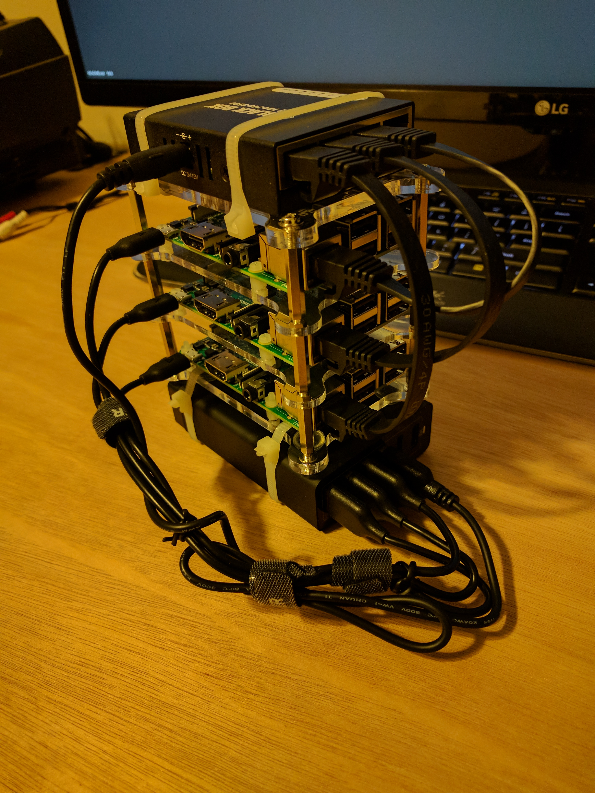
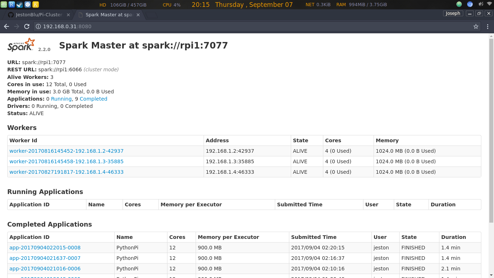
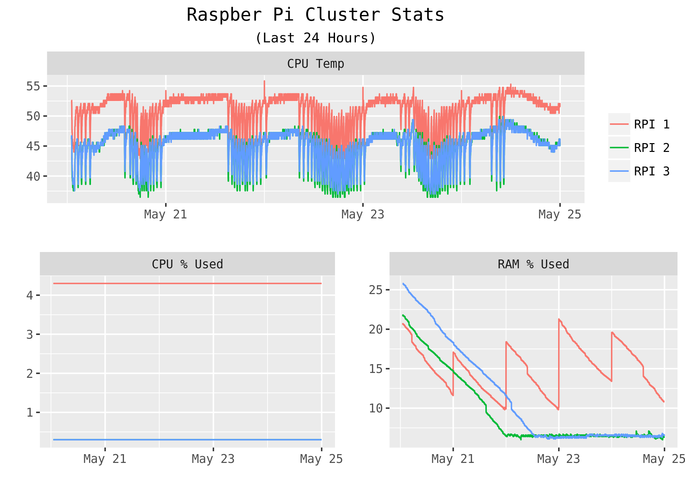

# PySpark Raspberry Pi Cluster Project

This repo is being used to document my project for building a small raspberry pi cluster running spark. Similar to [this article](http://makezine.com/projects/build-a-compact-4-node-raspberry-pi-cluster/) which I used as a guide, I only wanted to have to use a single wall plug for the entire setup. I also wanted to minimize the footprint of the cluster. In this example all of the devices except for the USB hub are powered by USB. I have broken the project into 3 sections: building the cluster, setting up the os, and configuring spark.

# Shopping List
* 3 - Raspberry Pi 3b, (i also added an old 2b, not shown in pictures)
* 1 - GeauxRobot Raspberry Pi 3 Model B 4-layer Dog Bone Stack (case)
* 1 - Anker PowerPort 6 (60W 6-Port USB Charging Hub) (power supply)
* 1 - Black Box USB-Powered 10/100 5-Port Switch
* 3 - 6" Ethernet Network Cable

# System Monitor

The following plot is the output of a pyspark job that plots the cpu temperature of all 4 rpis

