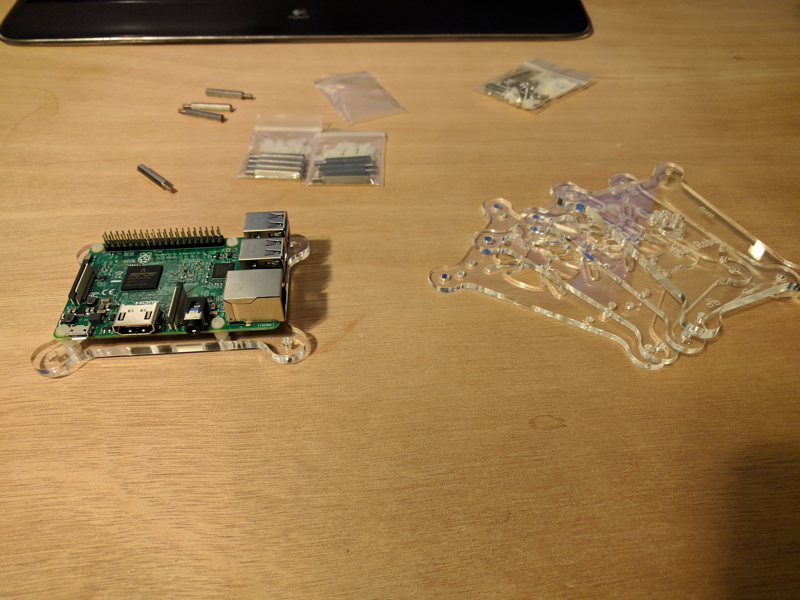
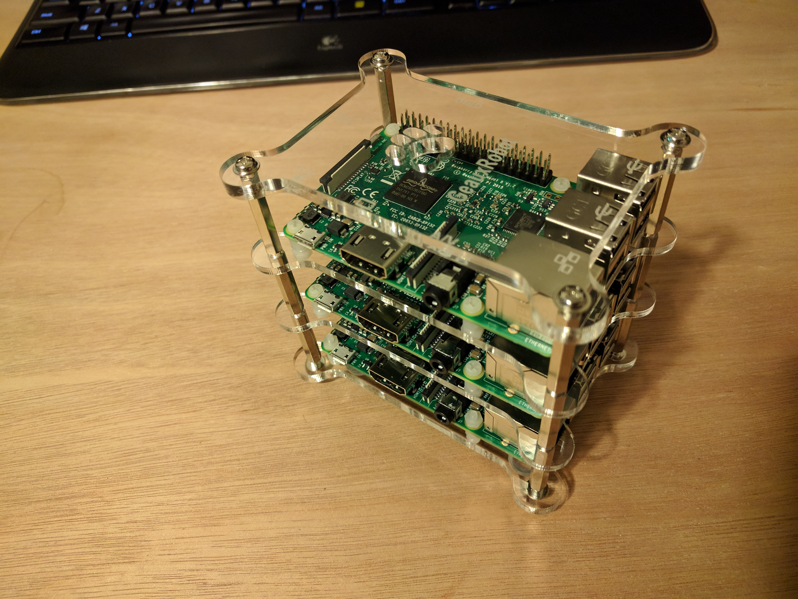
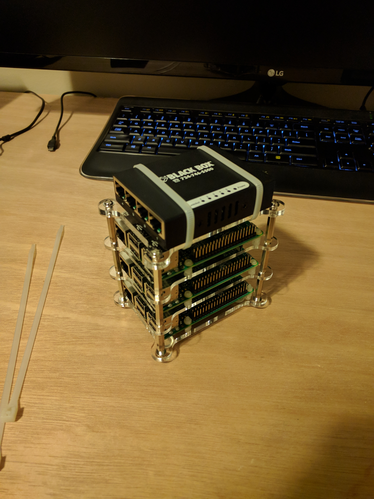
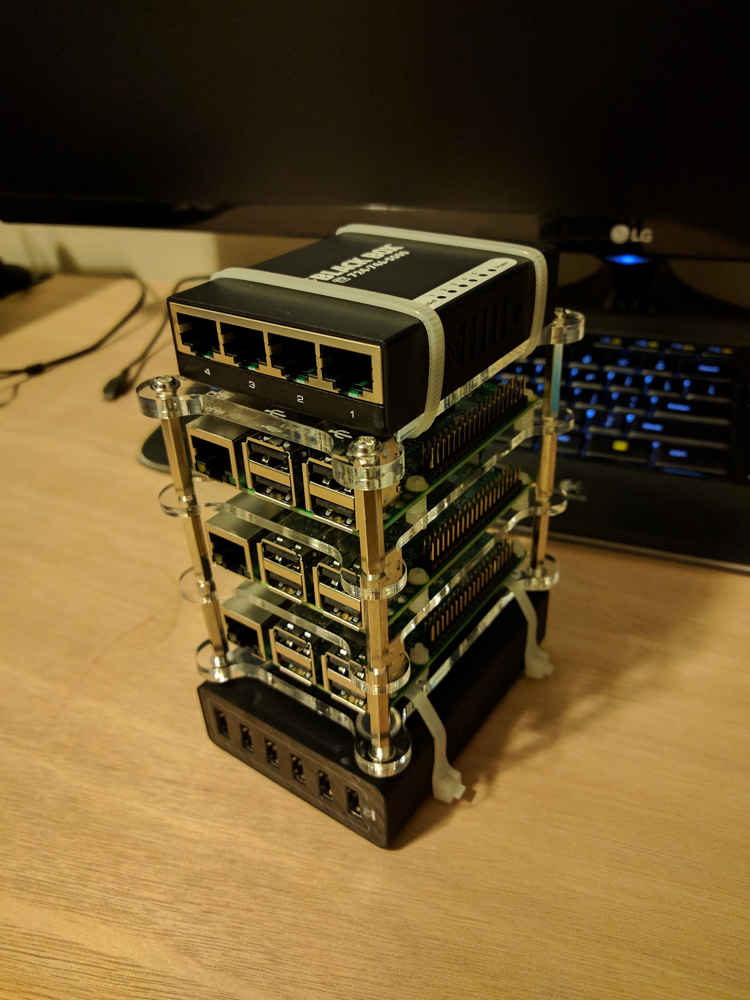
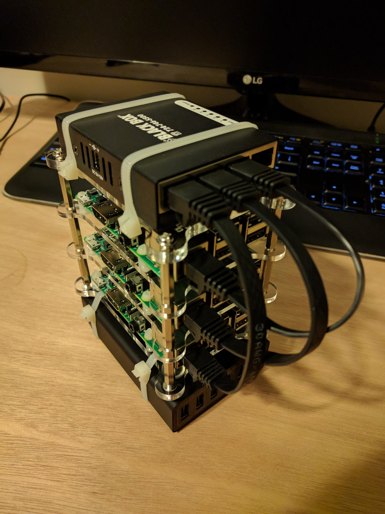
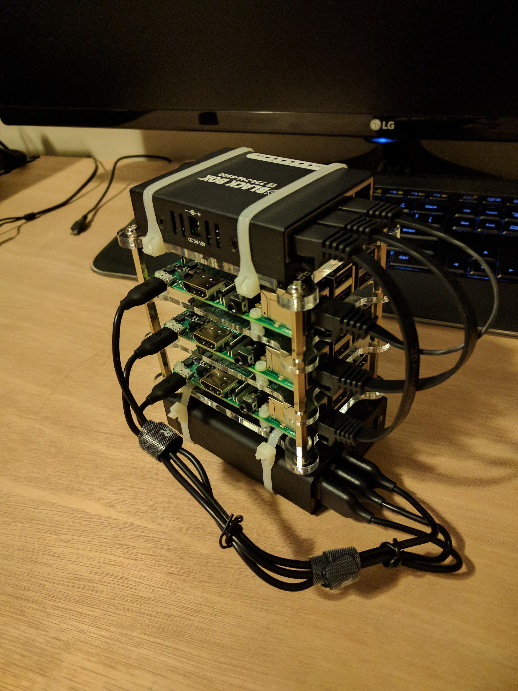

<!-- TOC depthFrom:1 depthTo:6 withLinks:1 updateOnSave:1 orderedList:0 -->

- [PySpark Raspberry Pi Cluster Project](#pyspark-raspberry-pi-cluster-project)
- [Shopping List](#shopping-list)
- [Assembly](#assembly)
- [Set up Environmental variables](#set-up-environmental-variables)

<!-- /TOC -->

# PySpark Raspberry Pi Cluster Project

This repo is being used to document my project for building a small raspberry pi cluster running spark. Similar to [this article](http://makezine.com/projects/build-a-compact-4-node-raspberry-pi-cluster/) which I used as a guide, I only wanted to have to use a single wall plug for the entire setup. I also wanted to minimize the footprint of the cluster. In this example all of the devices except for the USB hub are powered by USB.

# Shopping List
* 3 - Raspberry Pi 3b
* 1 - GeauxRobot Raspberry Pi 3 Model B 4-layer Dog Bone Stack (case)
* 1 - Anker PowerPort 6 (60W 6-Port USB Charging Hub) (power supply)
* 1 - Black Box USB-Powered 10/100 5-Port Switch
* 3 - 6" Ethernet Network Cable

# Assembly

1) Assemble the pi's and case. (I only used 3 of the 4 levels since I bought 3 pi's)



2) Attach the network switch to the top of the cluster


3) Attach the USB power supply to the bottom of the cluster


4) Attach the network cable


5) Attach the USB to mini-usb cables from the USB hub to each pi


6) Attach the USB cable to the network switch power input


# Setting up the OS
I already use arch on my desktop so im using that on the Pi's. The arch documentation for downloading and setting up the ARM OS is straightfoward so I will not repeat it, but the link to the site is [here](https://archlinuxarm.org/platforms/armv8/broadcom/raspberry-pi-3).

After booting up the first pi with a working arch install, the first thing I did was set up an internet connection. On my arch desktop I use Network Manager and the nm-applet. It is very easy to share the internet through this app. Simply create a new connection, on the IPv4 and IPv6 tabs change the method to `Shared to other computers`. Network manager automatically assigns an ip address to the pi. With the pi already plugged in to the switch the eth0 interfaces automatically turns on at boot and there is a working internet connection immediately.

The next thing I did was install some packages

```sh
# Assuming you are root
pacman -S base-devel bash-completion
```

Uncomment `en_US.UTF-8` in `/etc/locale.gen`, then run
```sh
locale-gen
echo LANG=en_US.UTF-8 > /etc/locale.conf
export LANG=en_US.UTF-8
```

Set the time zone
```sh
ln -s /usr/share/zoneinfo/America/Chicago > /etc/localtime
```

Set the host name
```sh
echo pi1 > /etc/hostname
```


Set up a new user and change passwords.

```sh
# Assuming you are root, change the root password
passwd

# Add a new user and change password
useradd -m -g users -G wheel,storage,power -s /bin/bash someusername
passwd someusername

# Delete the default user alarm
userdel -r alarm

```


# Set up Environmental variables

```sh
export JAVA_HOME=/usr/lib/jvm/java-8-openjdk
export PYTHONPATH=~/Apps/Miniconda3/envs/py35
export SPARK_HOME=~/Apps/Spark21

export PATH="$PYTHONPATH/bin:$PATH"
export PATH="$SPARK_HOME/bin:$PATH"
export PATH="$JAVA_HOME/bin:$PATH"

export SPARK_LOCAL_IP=localhost
```
